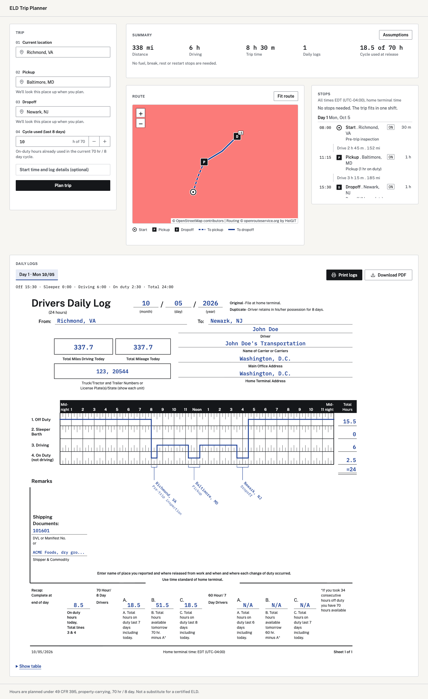
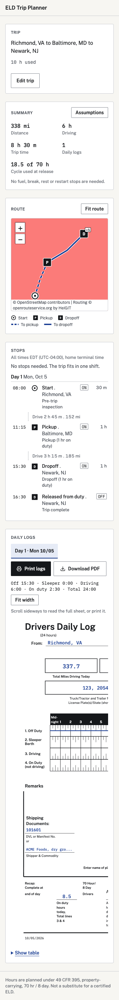
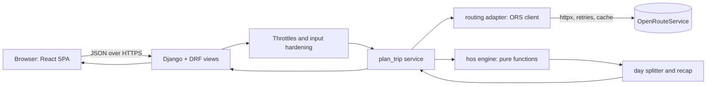

# ELD Trip Planner

A full-stack web app that takes a truck driver's trip and produces a route map plus filled FMCSA
Driver's Daily Log sheets that follow the US property-carrying Hours of Service (HOS) rules.

Inputs: current location, pickup location, dropoff location, and the hours already used in the
70 hr / 8 day cycle. Outputs: a route map with stops and rests, a duty-status timeline, and one
filled daily log sheet per calendar day of the trip.





## Live demo

Deployment is pending. These placeholders will be replaced when the URLs exist.

| What | URL |
|---|---|
| App (Vercel) | `<vercel-url>` |
| API (Render) | `<render-url>` |
| API health check | `<render-url>/api/v1/health` |
| API docs (Swagger) | `<render-url>/api/v1/docs` |
| Loom walkthrough | `<loom-url>` |

The API runs on Render's free tier and sleeps when idle. The first request after a sleep can take
30 to 60 seconds. The UI shows a "waking the server" state, and a keep-warm ping is set up (see
Deployment).

## What it does, mapped to the assessment

| Requirement | How it is met |
|---|---|
| Route map with the trip | Leaflet map with the driving route (OpenRouteService, HGV profile), numbered stops and rests, tile fallback to OSM |
| Stops and rests | Pickup, dropoff, fuel, 30 min breaks, 10 hr sleeper rests and 34 hr restarts are inserted by the engine and listed and mapped |
| Filled daily logs, one per day | Inline SVG of the FMCSA grid: duty-status line, 15 min ticks, remarks with city and state, recap block, totals of exactly 24.00 h per sheet. Print or save as PDF |
| 70 hr / 8 day cycle | `current_cycle_used_hours` counts from minute zero. Reaching 70 forces a 34 hr restart before more driving |
| Fuel at least every 1,000 miles | 30 min on-duty fuel stop, never more than 1,000 miles since the last one |
| 1 hr for pickup and dropoff | Each is 1 hr On Duty (not driving) |
| 11 hr driving, 14 hr window, 30 min break | Enforced by the engine and re-checked by an independent audit in tests |

The frontend never recomputes HOS. It renders what the API returns, so there is one engine and one
source of truth.

## How the HOS engine works

The engine is a pure function: legs (distance and driving time from the router) plus the cycle
hours and a start time go in, and a list of duty events, daily sheets and a summary come out. It
does no I/O, so it is deterministic and heavily testable. It simulates the trip in whole minutes,
choosing at each step the next legal action: drive, take a break, rest, restart or fuel.

Rules applied (49 CFR 395.3, property-carrying, 70 hr / 8 day):
11 hr driving limit, 14 hr on-duty window that breaks do not extend, a 30 min break before more than
8 cumulative driving hours, 10 hr off before a new shift, 70 hr cap in 8 days with a 34 hr restart.

### Assumptions (A1 to A17)

The task leaves gaps, so each is a stated decision. Choices that lean cautious are marked
**(conservative)**.

| # | Assumption in plain words | Why |
|---|---|---|
| A1 | The driver is Off Duty from 00:00 of day 1 until the start, with fresh 11 and 14 hr clocks | A log sheet must cover all 24 h, and a trip starts after a legal rest |
| A2 | Start is 08:00 home-terminal time on the trip date. The user can override it; it is snapped to 15 min | Sensible default, and the form needs none |
| A3 | Home-terminal zone is the current location's zone, frozen to its UTC offset for the whole trip | Every day is then exactly 24 h. No 23 or 25 hr daylight-saving days breaking the 24.00 total |
| A4 | 30 min On Duty pre-trip inspection at the start of every shift | Real practice, and it uses window time **(conservative)** |
| A5 | No separate post-trip block | Covered by the 1 hr dropoff |
| A6 | Pickup and dropoff are 1 hr On Duty each | Given by the assessment |
| A7 | Fuel is 30 min On Duty, never more than 1,000 miles since the last fuel. The truck starts full | Given by the assessment, plus a clear starting state |
| A8 | The 30 min break is satisfied by any stretch of 30 or more consecutive non-driving minutes. Otherwise 30 min Off Duty is inserted | Matches the rule, and avoids redundant breaks |
| A9 | A 10 hr rest is logged as Sleeper Berth | Typical for a long-haul truck |
| A10 | A 34 hr restart is logged Off Duty. It is taken when the 70 hr cap blocks driving, or when a rest is due but fewer than 14 cycle hours remain and they do not cover the remaining work. A starting cycle of 69.5 h or more restarts before the first pre-trip | Avoids planning a shift that cannot be finished legally |
| A11 | No hours drop off the 8 day window during the trip **(conservative)** | The user gives only a single total. Assuming nothing expires never overstates what the driver can do |
| A12 | Driving time per leg comes from the router's HGV duration, not a flat speed | More realistic than 55 mph |
| A13 | Integer-minute simulation, every event on the 15 min grid, rounding toward compliance | Matches the paper grid and never rounds into a violation **(conservative)** |
| A14 | No split sleeper, adverse driving conditions, short-haul exemption, personal conveyance or pilot programs | Out of scope, and each would loosen limits **(conservative)** |
| A15 | Off Duty after the dropoff until 24:00 of the last day | Sheets must total 24 h |
| A16 | Driving resumes immediately when it is legal | Simplest deterministic policy |
| A17 | If a due 30 min break would leave under 15 min of driving in the 14 hr window, take the 10 hr rest instead | A break that buys almost no driving is wasted time |

### Known limits

- No split sleeper berth, adverse driving conditions, or 16 hr short-haul exception.
- Lower 48 states only. Locations outside are rejected with a typed error.
- Conservative cycle model (A11): a driver whose old hours would roll off mid-trip may be given an
  earlier restart than strictly needed. The plan is legal, just not always minimal.
- Trips over 6,000 miles are rejected (`TRIP_TOO_LONG`).
- Not a certified ELD and not legal advice. It is a planning tool.

## Architecture



| Concern | Design |
|---|---|
| Layering | `hos/` is a pure engine with no Django or network imports. `routing/` is the only code that talks to ORS. `trips/` is the thin API layer that wires them together |
| Endpoints | `GET /api/v1/health`, `GET /api/v1/places/autocomplete`, `POST /api/v1/trips/plan`, plus `/api/v1/schema` and `/api/v1/docs` |
| Error model | Every failure is `{"error": {"code", "message", "request_id", ...}}` with a typed code (for example `VALIDATION_ERROR`, `LOCATION_NOT_FOUND`, `UNSUPPORTED_LOCATION`, `TRIP_TOO_LONG`, `RATE_LIMITED`, `UPSTREAM_QUOTA_EXCEEDED`, `UPSTREAM_UNAVAILABLE`). Never a stack trace. Errors carry `Cache-Control: no-store` |
| Caching | Django LocMemCache for public geodata only (geocode, directions, reverse geocode), keyed by hashed normalized input. Never caches 5xx, timeouts or 401/403/429. Lost on restart, which is fine. Separate cache aliases for routes, throttle counters and ORS budgets so one cannot evict another |
| Throttling | Per-IP and global limits on plan and autocomplete (for example plan: 10/min and 100/day per IP, 18/min and 900/day global), in-flight guards so slow plans cannot take every worker thread. Health is exempt |
| ORS quota protection | Global request budgets checked before each ORS call, sized under the free plan quotas. A spent reverse-geocode budget degrades to "near <place>" labels instead of failing. A 25 s total deadline covers retries |
| Contract | The OpenAPI schema is generated (drf-spectacular) and the frontend types are generated from it. CI fails on drift |

## Tech stack

| Area | Choice |
|---|---|
| Backend | Python 3.13, Django 5.2, Django REST Framework 3.18, drf-spectacular, django-cors-headers, django-environ |
| Routing client | httpx 0.28, tenacity, timezonefinder |
| Server | gunicorn (gthread), uv for dependencies |
| Backend tests | pytest 9, pytest-django, hypothesis, respx, ruff |
| Frontend | Vite 8, React 19, TypeScript 6, Tailwind 4, shadcn/ui on Base UI |
| Frontend data | TanStack Query 5, react-hook-form, zod, openapi-fetch and openapi-typescript |
| Map | react-leaflet with Leaflet 1.9, CARTO Positron tiles with OSM fallback |
| Frontend tests | Vitest, Testing Library, Playwright 1.63 |
| Hosting | Render (API), Vercel (SPA) |

Exact pins are in `backend/pyproject.toml` and `frontend/package.json`.

## Run locally

Prerequisites: Python 3.13 with [uv](https://docs.astral.sh/uv/), and Node.js with npm.

**1. Get an OpenRouteService key (free).** Sign up at https://account.heigit.org, create a token,
and keep it private. It is only needed to actually plan trips. Tests do not need it.

**2. Backend**

```bash
cd backend
cp .env.example .env
# edit .env: set ORS_API_KEY, keep DJANGO_DEBUG=true
make install
make run                              # http://localhost:8000
```

`.env` is git-ignored. Never commit it.

**3. Frontend** (second terminal)

```bash
cd frontend
cp .env.example .env
npm install
npm run dev                           # http://localhost:5173
```

**Environment variables**

| Variable | Where | Needed | Notes |
|---|---|---|---|
| `ORS_API_KEY` | backend | yes, to plan trips | Server side only |
| `DJANGO_DEBUG` | backend | local only | `true` locally. The app refuses to boot with `true` on Render |
| `DJANGO_SECRET_KEY` | backend | production | Long random string. Not needed with debug on |
| `DJANGO_ALLOWED_HOSTS` | backend | production | Comma list |
| `CORS_ALLOWED_ORIGINS` | backend | yes | Exact origins, no wildcard. Local: `http://localhost:5173` |
| `NUM_PROXIES` | backend | production | Integer of 1 or more behind a proxy, 0 locally |
| `VITE_API_BASE_URL` | frontend | yes | Backend origin, default `http://localhost:8000` |
| `VITE_CARTO_API_KEY` | frontend | optional | Free public CARTO tile key. Without it the map uses OSM tiles |

The CARTO key is optional and is public by design (restrict it by domain in the CARTO dashboard).
Never put the ORS key in a `VITE_` variable, because those are bundled into public JavaScript.

## Testing

```bash
# Backend (no ORS key needed, ORS is mocked and real network is blocked in tests)
cd backend
make test          # HYPOTHESIS_PROFILE=ci
make test-deep     # heavier hypothesis run
make lint          # ruff check + format check
make check         # lint + test

# Frontend
cd frontend
npm test                # Vitest
npm run lint && npm run typecheck
npm run test:e2e        # Playwright, opens a headed browser window
```

| Layer | What it checks |
|---|---|
| Engine fixtures (`backend/tests/hos/test_fixtures.py`) | Hand-computed scenarios 8a to 8h: the FMCSA sample sheet, a Chicago to Indianapolis to Denver trip at cycle 20 and 62, a short trip, a start-of-trip restart at cycle 70, a zero-length first leg, and restarts that span or end at midnight |
| Property tests (hypothesis) | Random trips must satisfy invariants such as 24.00 h per sheet, no limit exceeded, contiguous events, fuel spacing. An independent `audit()` oracle re-derives legality from the output rather than reusing engine code |
| Routing adapter (respx) | Every ORS failure (401, 403, 429, 5xx, timeout, malformed body) maps to one typed error. Retries, deadline, caching and key hygiene |
| API contract | Responses validated against the OpenAPI schema, error model, throttles, CORS, input validation |
| Frontend (Vitest) | Log sheet geometry, form validation, error mapping, loading, empty and error states |
| Playwright | Config and CI job are in place. The `frontend/e2e/` folder is currently empty, so the browser flows were verified manually (screenshots above) and there are no committed E2E specs yet |

CI (`.github/workflows/ci.yml`) runs lint, tests, OpenAPI drift and API type drift checks, and a
frontend build with a bundle-size check.

## Deployment

| Piece | Where | Notes |
|---|---|---|
| API | Render free web service from `render.yaml` (`rootDir: backend`) | Secrets are set in the dashboard, not in the repo. Health check path `/api/v1/health` |
| SPA | Vercel from `frontend/` | `vercel.json` sets a strict CSP and security headers. The browser calls the API directly over CORS |
| Keep-warm | UptimeRobot pings `/api/v1/health` every 5 min, plus a warm-up ping when the SPA loads | Health never calls ORS, so pings cost no quota |

Deployment is pending, so live URLs are placeholders above.

## Security notes

- The ORS key lives only in backend environment variables. It is sent in an `Authorization`
  header, never in a URL, log line, error body or the frontend bundle.
- CORS uses an exact-origin allowlist with no wildcard.
- Per-IP and global throttles, plus in-flight guards, protect both the server threads and the ORS quota.
- Inputs are hardened: 8 KB body cap, JSON content type enforced, length limits, control and
  format characters rejected, and finite-number bounds on the cycle hours.
- The app refuses to boot with `DJANGO_DEBUG=true` on Render and requires a proxy count in production.
- Frontend responses carry a CSP, `X-Frame-Options: DENY`, HSTS and related headers.

## Project layout

```
eld-trip-planner/
  README.md
  render.yaml                 Render blueprint (no secrets)
  PITFALLS.md                 invariants that must never break
  screenshots/                images used in this README
  .github/workflows/ci.yml
  backend/
    hos/                      pure HOS engine: simulator, rules, day splitter, recap
    routing/                  ORS adapter: client, geometry, labels, cache keys, budgets, errors
    trips/                    API: views, serializers, throttles, services/plan_trip.py
    config/                   Django settings, urls, wsgi
    tests/                    hos/, routing/, trips/
    openapi.json              generated API schema
    Makefile  pyproject.toml  uv.lock  gunicorn.conf.py
  frontend/
    src/features/             trip-form, map, results, logs (SVG log sheets)
    src/services/             typed API client (generated types)
    e2e/                      Playwright specs (none committed yet)
    vercel.json  package.json  vite.config.ts
```

## Walkthrough

Loom video: `<loom-url>` (placeholder until recorded).
